# Reservita - Visual Gallery

Visual documentation of the Reservita event ticketing platform.

## Public Pages

### Home Page

Landing page with event discovery and category browsing.

- Hero section with search
- Category filters
- Featured events grid

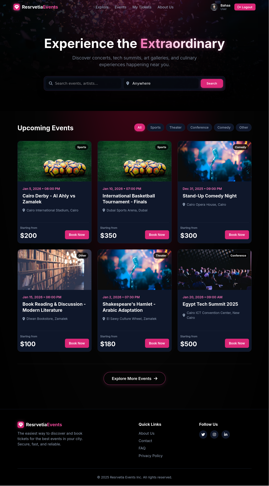

### Browse Events

Advanced event browsing with filters and sorting.

- Multi-criteria filtering
- Sorting options
- Pagination
- Wishlist integration

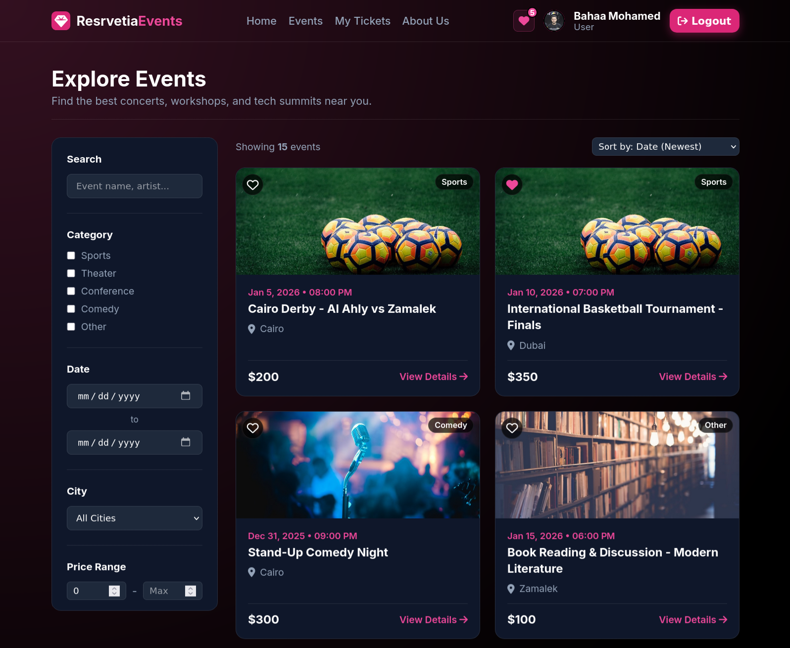

### About Us

Team showcase and project information.

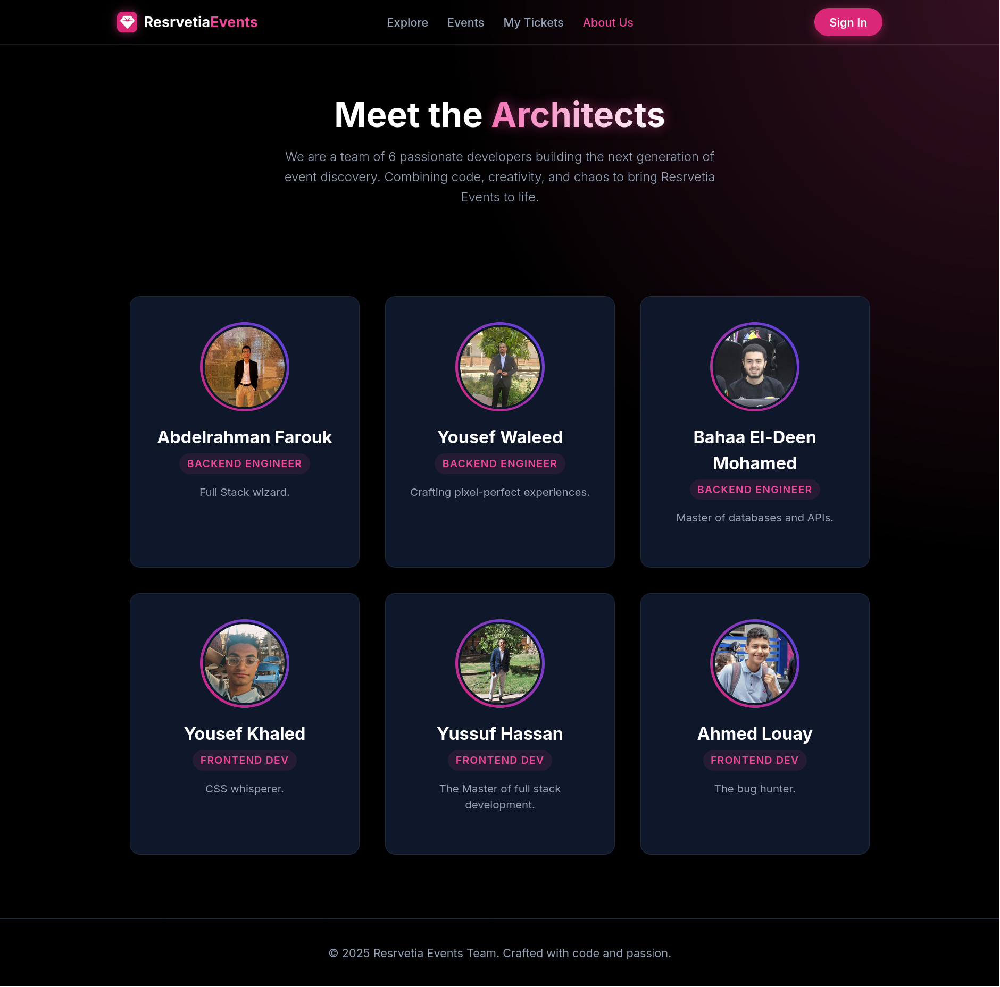

---

## Authentication

### Sign In / Sign Up

Unified authentication page with tabbed interface.

- User type selection (Regular User / Agency)
- Form validation

<table>
  <tr>
    <td width="50%">
      <strong>Sign In</strong> 
      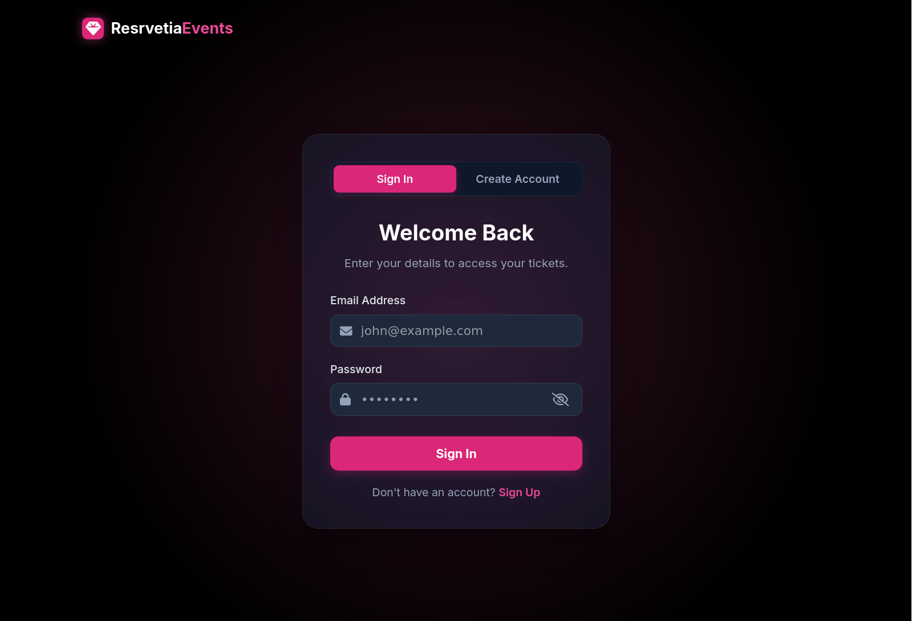
    </td>
    <td width="50%">
      <strong>Sign Up</strong> 
      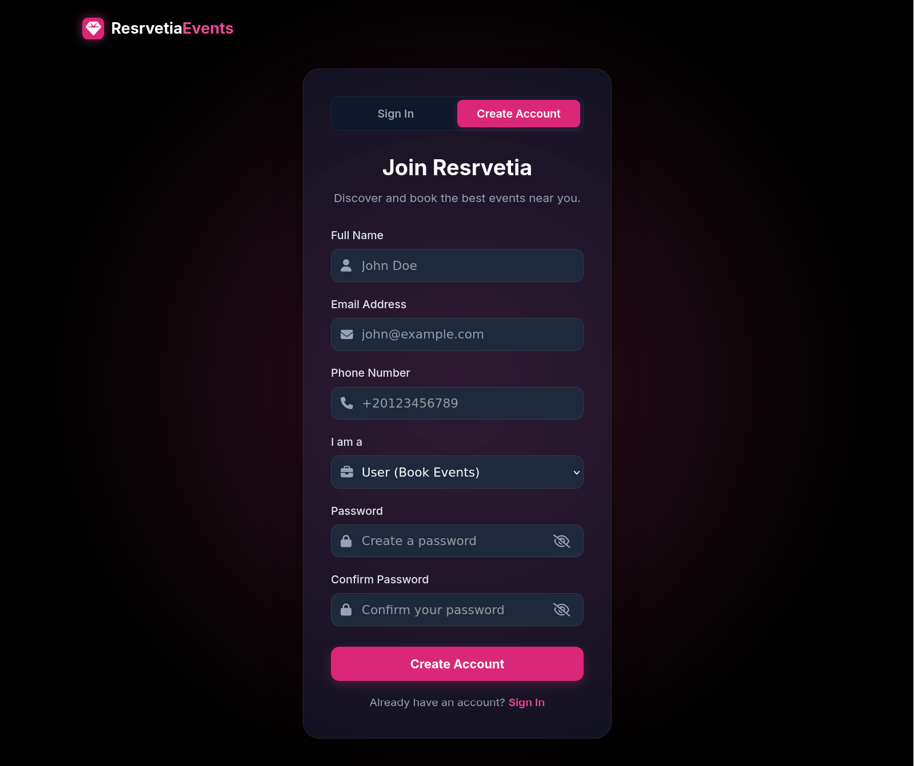
    </td>
  </tr>
</table>

---

## Event Discovery & Booking

### Event Details

Comprehensive event information with booking capabilities.

- Hero banner with event image
- Image gallery
- Interactive seat selection
- Reviews preview

### Seat Selection

Interactive seating chart for ticket booking.

- Visual seat map
- Color-coded seats (Available, VIP, Occupied, Selected)
- Real-time price calculation
- Selection limit (max 6 seats)

### Reviews

Review submission and display for events.

- Star rating system
- Comments
- Like/Dislike functionality

---

## User Dashboard

### My Tickets

User ticket management and history.

- Statistics cards
- Ticket filters
- Seat management
- Action buttons

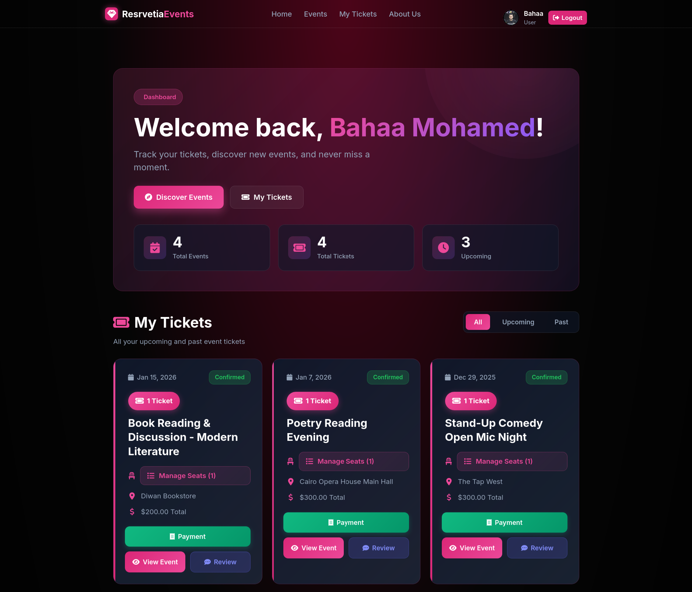

### Wishlist

Saved events for future booking.

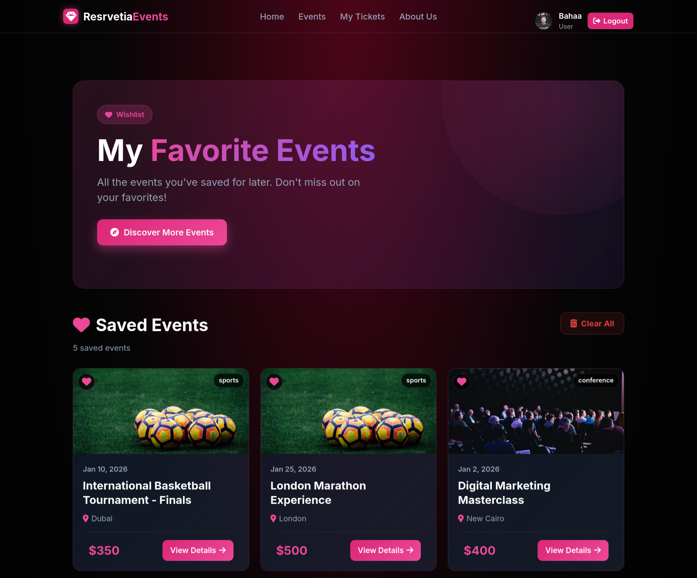

### Profile Settings

User account management.

- Profile photo upload
- Account details editing
- Password change

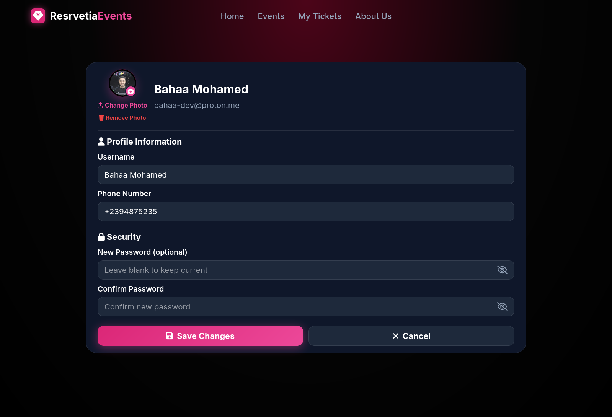

---

## Agency Dashboard

### Agency Dashboard

Event management for agencies.

- Analytics cards
- Create/Edit events
- Revenue tracking

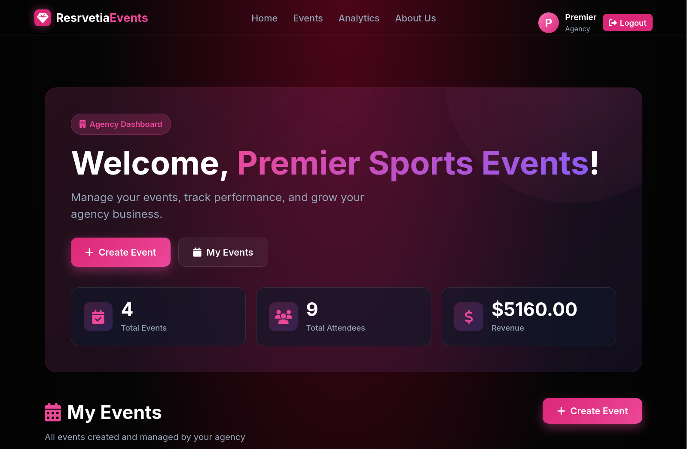

### Create Event

Multi-image gallery upload and event configuration.

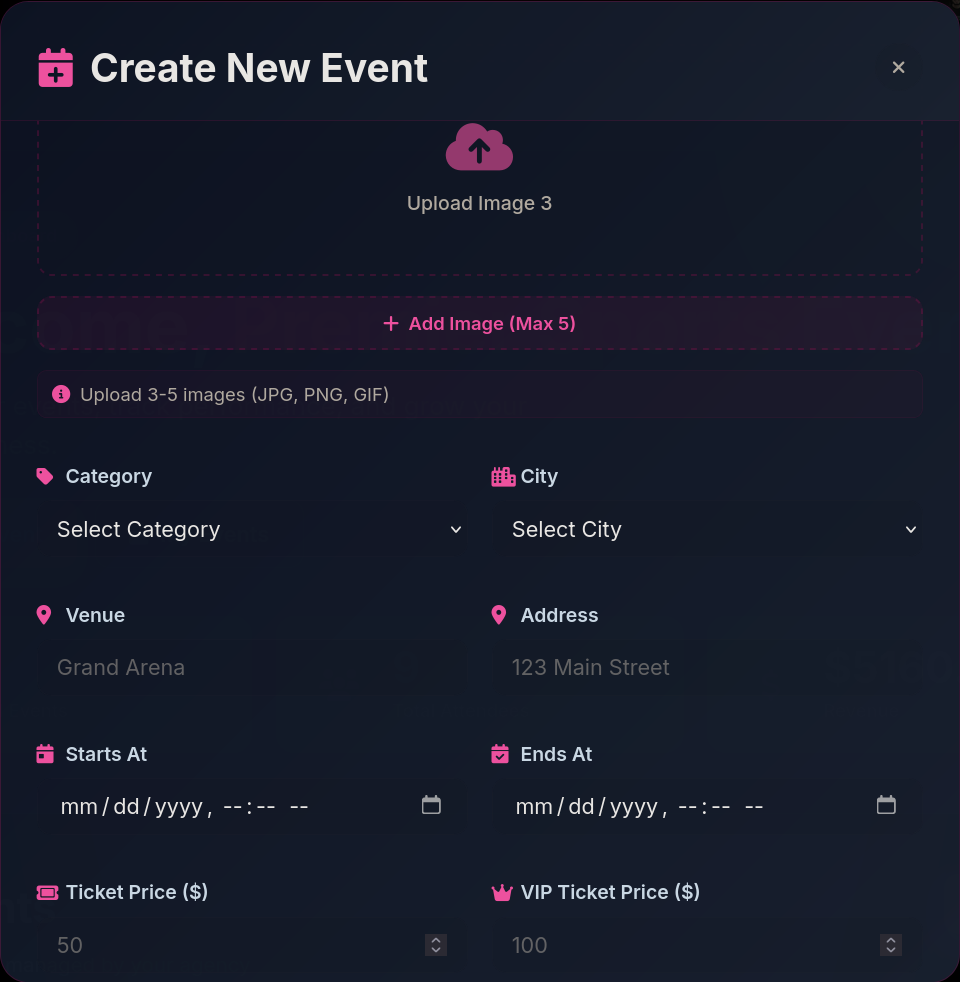

---

## Payment & Features

### Payment Success

Post-booking confirmation with QR codes.

- Success animation with confetti
- Multiple QR codes (one per ticket)
- Download tickets

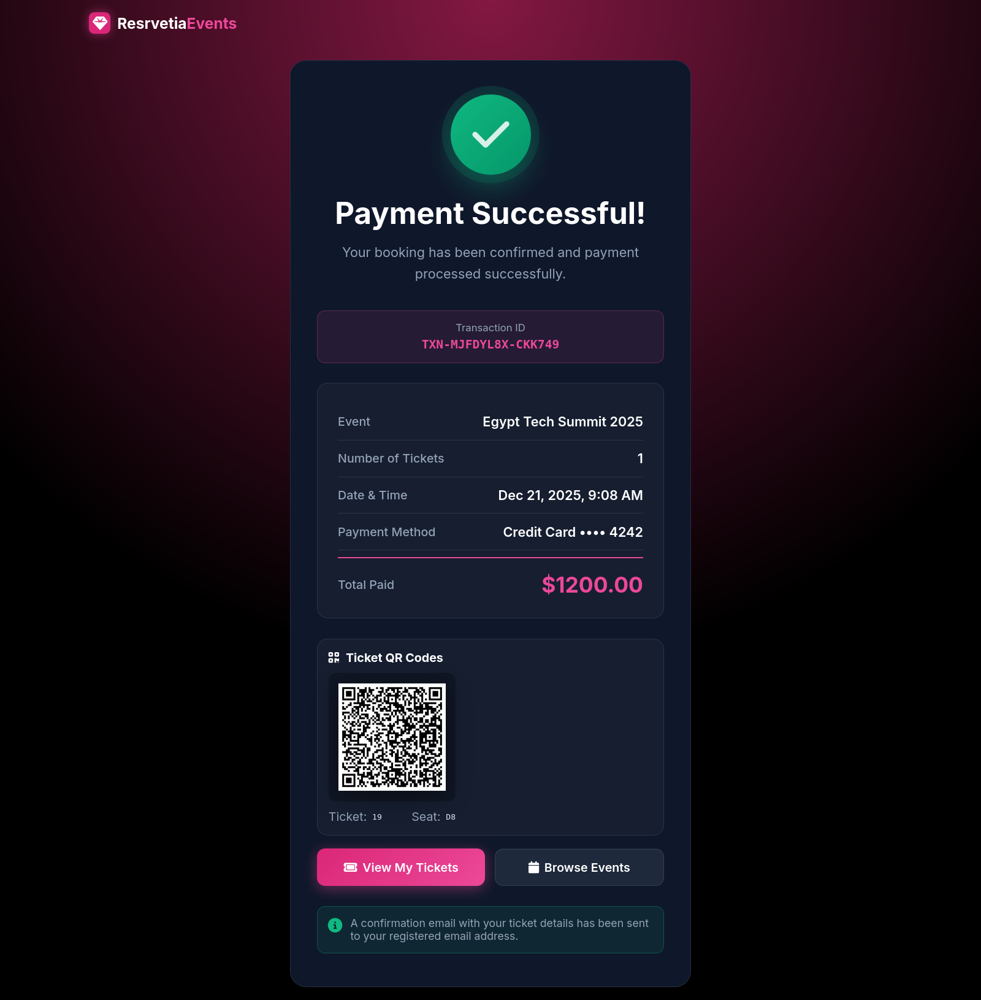

### QR Scanner

Ticket verification system for agencies.

- Live camera preview
- Real-time QR detection
- Ticket validation

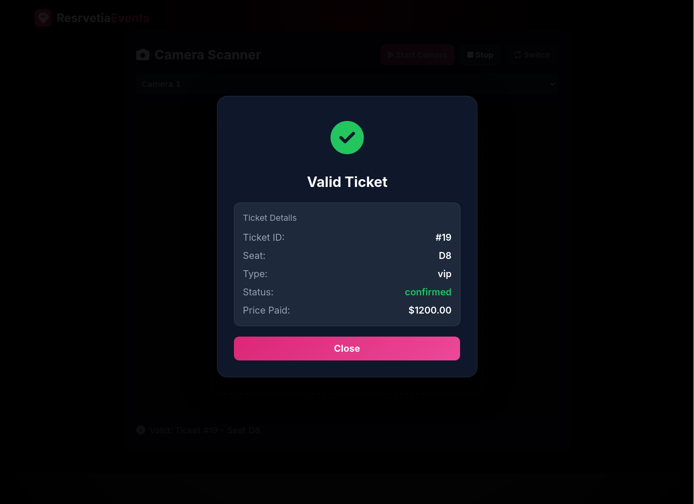

---
